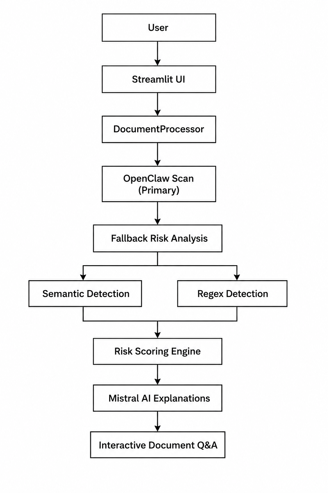

# 🦞 DocAware

**AI-powered document risk analysis assistant built for the DataVita OpenClaw Challenge.**

DocAware helps users understand potentially risky document clauses before committing by combining document processing, AI orchestration, semantic analysis, and conversational document Q&A.

This project demonstrates a practical legal-tech AI workflow using OpenClaw, OCR, NLP, and LLM-powered document assistance.

---

# Project Overview

Contracts often contain hidden risks that non-technical users may not easily understand.

DocAware allows users to upload documents and instantly:

- Detect risky clauses
- Understand them in plain English
- See exact document references
- Ask follow-up questions conversationally

Supported document types:

- PDF
- DOCX
- TXT

---

# Key Features

✅ AI-powered document risk analysis  
✅ OpenClaw agent-based orchestration  
✅ OCR and document text extraction  
✅ Semantic clause detection (meaning-based matching)  
✅ Regex fallback risk detection  
✅ Exact page + line references for risky clauses  
✅ Plain-English risk explanations  
✅ Interactive document Q&A assistant  
✅ Suggested follow-up negotiation questions  
✅ PDF viewer inside the application  
✅ Risk scoring dashboard  
✅ Docker container support  

---

# How the System Works

## 1. Document Upload

The user uploads a document through the Streamlit interface.

Supported formats:

- PDF
- DOCX
- TXT

---

## 2. Document Processing

The document is processed by the `DocumentProcessor` service.

Responsibilities:

- Extract text page by page
- Clean formatting noise
- Preserve page mapping
- Build combined document text for AI analysis

Output:

- `clean_page_texts`
- `clean_text`

---

## 3. OpenClaw AI Scan (Primary Analysis)

DocAware uses OpenClaw as the primary document analysis orchestrator.

The uploaded document is passed into the OpenClaw scanning pipeline, which attempts to detect risky clauses using the configured agent workflow.

Examples of risks:

- non-refundable payments
- auto-renewal terms
- hidden fees
- liability waivers
- unilateral changes
- debt recovery clauses

If OpenClaw successfully detects risks, those results are used directly.

---

## 4. Fallback Risk Detection

If OpenClaw does not return results, the application falls back to local analysis.

### Semantic Detection

embedding models:

- `sentence-transformers`
- `all-MiniLM-L6-v2`

This detects clauses based on meaning, not just exact keywords.

Example:

A clause saying:

> "You may lose your deposit regardless of cancellation reason"

can still match:

> non-refundable payment risk

even if wording differs.

---

### Regex Detection

Pattern-based scanning detects exact risky phrases such as:

- "non-refundable"
- "automatic renewal"
- "processing fee"
- "without notice"
- "indemnify"

Results from semantic and regex scanning are merged to remove duplicates.

---

## 5. Risk Scoring

Detected clauses are scored using the internal risk scoring engine.

The dashboard calculates:

- overall risk score
- severity breakdown
- total number of detected clauses

Example:

- Overall Score: 7/10
- High Risks: 3
- Medium Risks: 2

---

## 6. Plain-English Explanations

Each detected clause is explained using Mistral AI.

Instead of legal jargon, users see simple explanations.

Example:

Instead of:

> Broad indemnity clause

Users see:

> This clause may make you financially responsible for losses or damages, even when the other party is partly responsible.

---

## 7. Interactive Document Q&A

Users can ask follow-up questions about the uploaded document.

Examples:

- Can I negotiate this clause?
- What happens if I cancel early?
- Is this fee legally normal?
- What risks should I ask about?

The assistant uses:

- uploaded document content
- scan context
- previous conversation state

to provide contextual answers.

---

# System Architecture



# Project Structure

```text
docaware/
│
├── app.py
├── requirements.txt
├── Dockerfile
├── .dockerignore
├── .gitignore
├── README.md
│
├── services/
│   ├── ai_assistant.py
│   ├── document_processor.py
│   ├── risk_analyzer.py
│   └── scanner_service.py
│
├── tools/
│   ├── scanner.py
│   ├── semantic_scanner.py
│   └── extract_text.py
│
├── data/
│   └── suggested_questions.py
```

---

# Technology Stack

## Frontend
- Streamlit

## Backend
- Python

## Document Processing
- PyMuPDF
- pdfplumber
- python-docx
- pytesseract OCR

## AI / NLP
- OpenClaw
- Mistral AI
- sentence-transformers
- PyTorch
- scikit-learn

## DevOps
- Docker

---

# Installation (Local Setup)

## Clone repository

```bash
git clone <your-repository-url>
cd docaware
```

---

## Create virtual environment

Windows:

```bash
python -m venv venv
venv\Scripts\activate
```

Mac/Linux:

```bash
python3 -m venv venv
source venv/bin/activate
```

---

## Install dependencies

```bash
pip install -r requirements.txt
```

---

## Configure environment variables

Create:

```text
.env
```

Add:

```env
MISTRAL_API_KEY=your_api_key_here
```

---

## Run application

```bash
streamlit run app.py
```

Then open:

```text
http://localhost:8501
```

# Example Use Cases

DocAware can be used for:

- tenancy agreements
- subscription documents
- service agreements
- supplier documents
- general document review
- hidden fee detection
- renewal clause review

---

# Challenge Context

This project was built for the **DataVita OpenClaw Challenge**.

The objective was to demonstrate practical use of OpenClaw within a real AI workflow.

DocAware uses OpenClaw as the primary orchestration layer for document analysis while combining additional NLP and LLM components to deliver a practical end-to-end user experience.

---

# Known Limitations

- Not legal advice
- OCR quality depends on document quality
- AI explanations depend on API availability
- Semantic scanning can increase processing time
- Complex legal interpretation still requires professional review

---

# Future Improvements

Potential enhancements:

- downloadable PDF risk reports
- document comparison mode
- user authentication
- persistent document history
- clause confidence scoring
- multi-document comparison
- improved semantic classification

---

# Disclaimer

DocAware is an informational AI tool and does not provide legal advice.